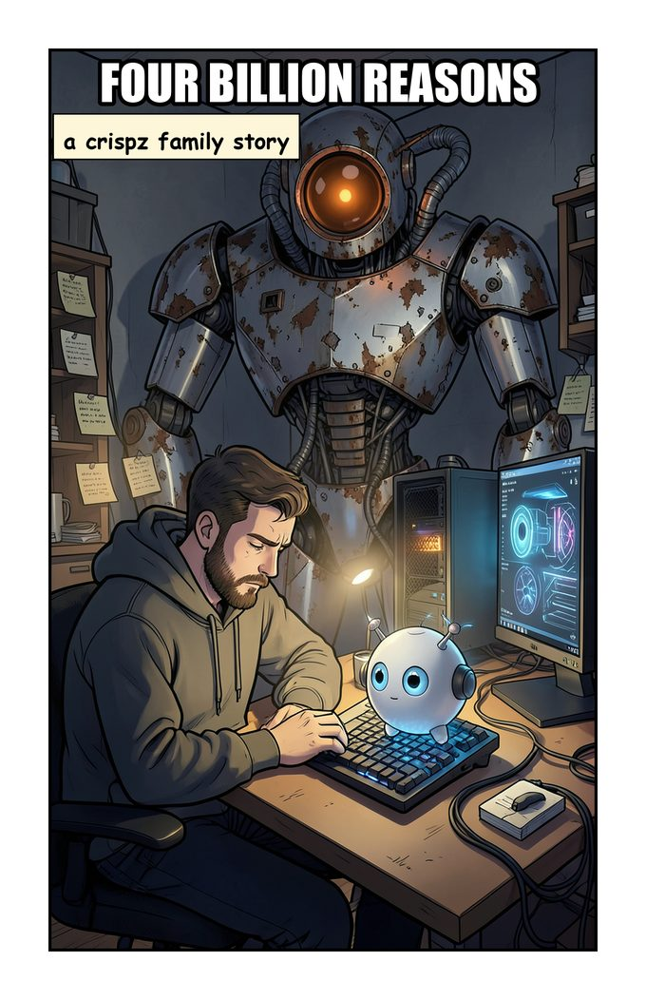
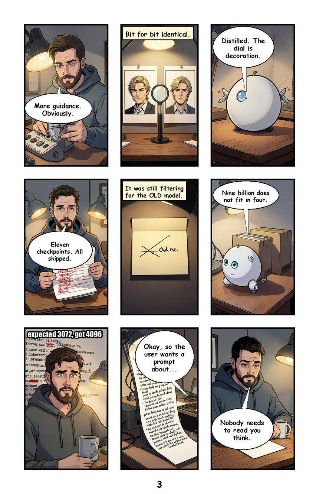
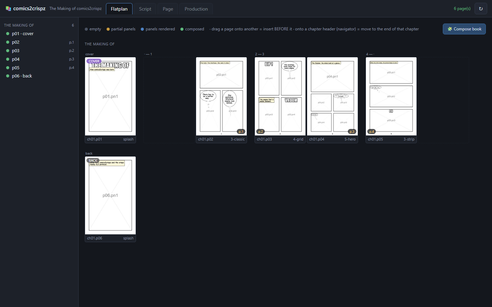
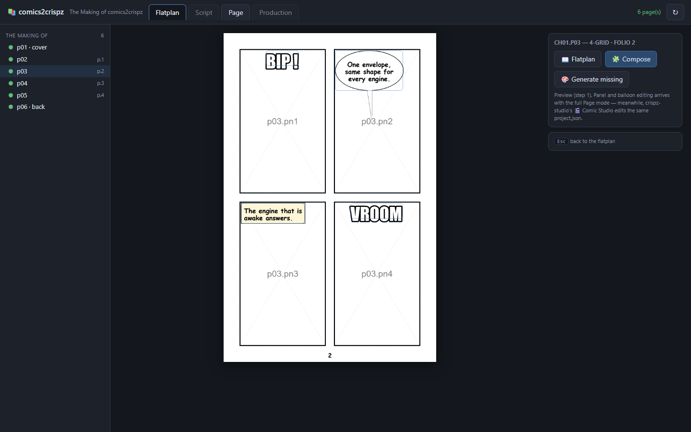
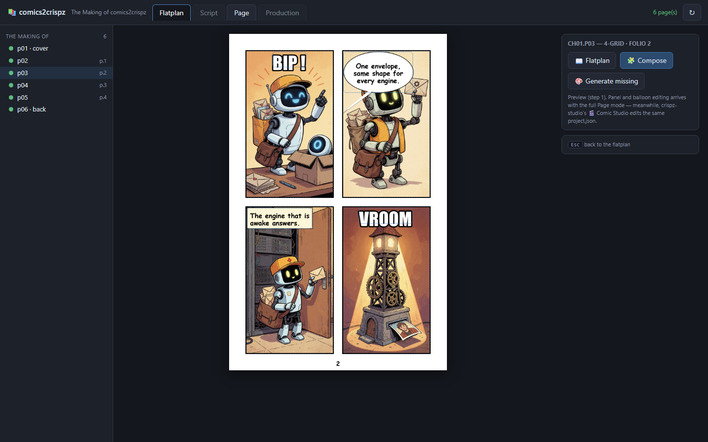
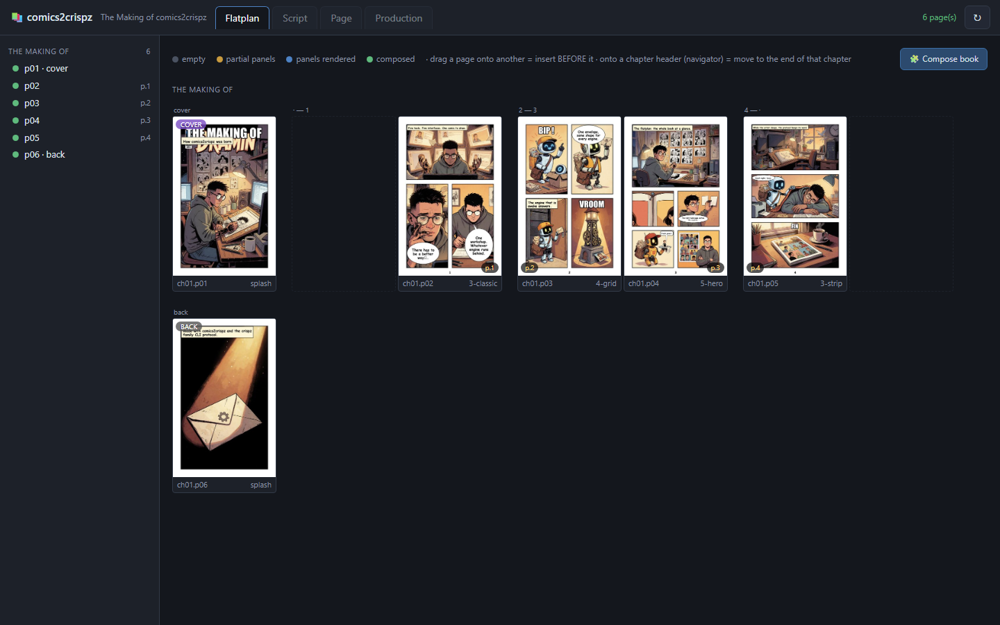

# comics2crispz

Local, **engine-agnostic comic book workshop**: the app generates nothing
itself — it drives the crispz family tools (crispz-studio, crispz-qwen-edit,
crispz-krea…) through the [family CLI protocol v1](docs/CLI_PROTOCOL.md):
JSON spec in, JSON out, routed to the running instance (warm model, one GPU
queue).

A project is a folder with a **crispz-family-compatible `project.json`**
(the documentary engine `cz_comic.py` is vendored from crispz-studio): the
🎞 Comic accordion of crispz-studio, its 🎬 Comic Studio, the `--comic` CLI
and comics2crispz all work on the same file, each of them stateless.

*Version française : [README.fr.md](README.fr.md).*

---

## What it produces

📖 **[Four Billion Reasons — read the PDF](docs/four-billion-reasons.pdf)** — 6 pages,
drawn end to end by the crispz family through the CLI protocol. No panel was retouched
by hand.

| | |
|---|---|
|  |  |
| The cover. | Page 3 — nine panels, recurring character, balloons placed by the app. |

The story is what actually happened while building the engines this app drives: a
guidance dial that turns out to be decoration on a distilled model, `expected 3072, got
4096` when a 9B LoRA meets a 4B base, eleven checkpoints skipped by a filter still set
to the previous model. The book is the bug report.

Source project: `books/klein-genesis/`, built by
[`tools/make_klein_genesis.py`](tools/make_klein_genesis.py) — the script writes the
script, so the book is reproducible from one command. The older
📖 **[Making of comics2crispz](docs/the-making-of.pdf)** follows the tutorial below
step by step.

---

## Install / run

```bat
start.bat
```

That's it: first run installs everything (venv + Pillow + config + an example
book), then your **most recently edited book opens in the browser**. Inside
the app, the **📚 menu** switches between books and **➕ New book** creates
one (cover + a first 4-panel page, ready to fill); the very first launch
shows a welcome screen. Linux/macOS: `./start.sh`. Power users:

```bat
run.bat books\exemple             REM serve a specific book, no browser
start.bat books\autre --port 8771 REM a second book side by side
```

Dependencies: Python 3.10+, Pillow. The server is pure stdlib
(http.server), no framework. Copy `config-sample.json` to `config.json`
(local, gitignored) and point the `engines` entries to your crispz installs.

## The UI

Four modes on a permanent chapter/page navigator:

| Mode | Status | Content |
|---|---|---|
| **Flatplan** | ✅ step 1 | facing-page spreads (the right-hand page carries the beat), role badges, folios, progress colors (empty / partial / rendered / composed), **drag & drop** to reorder or change chapter (drop on a page = insert before; on a chapter header = append), Compose page/book |
| **Page** | preview + generation | the composed page + panel rects + balloons, **🎨 Generate missing**: panels without an image go to the configured engine through the CLI protocol (prompt resolved by the @Name casting, exact panel ratio, `project.json` saved after each panel, empty panel texts skipped with a warning — an empty prompt is never sent to an engine), then the page recomposes; fine editing (balloon drag, dialogues) = next step — meanwhile crispz-studio's Comic Studio edits the same project |
| **Script** | step 2 | the whole book as text (`.czs` format) |
| **Production** | step 3 | counter-filters, batch through the CLI protocol |

House rules inherited from the family: nothing is lost silently (an
impossible move is an explained error, never a quiet clamp), **page ids are
stable** (the `panels/` and `pages/` paths never move when reordering — the
folio is what readers see), atomic `project.json` writes.

## Tutorial — a full book, step by step

This walkthrough builds *The Making of comics2crispz*, a short comic telling
how this app came to be, and generates it end-to-end through a family
engine. Every screenshot below comes from this exact flow.

### 1. Install and configure

```bat
install.bat
```

Edit `config.json`: each engine has the `url` of its running app (preferred
route — warm model, shared GPU queue) and the `czp` path of its CLI (cold
fallback). Start ONE family app (crispz-studio, krea2… whichever model you
want to draw with) and check the wiring:

```bat
D:\Github\crispz-krea2\czp.bat caps
```

`"instance": {"running": true, …}` = ready.

### 1b. Pick the book format

The wizard asks for the **book format**: Franco-Belge 24×32 cm, A4, US comic
17×26 cm, Manga 13×18 cm (ticks the right-to-left reading), Graphic novel
17×24 cm, Square album 21×21 cm, Landscape 29.7×21 cm (all 300 dpi with
print-realistic margins and 5 mm gutters), or Web / Webtoon for the screen.
Panels are drawn at about 1 megapixel whatever the format (the print export
upscales them); the format decides the page proportions and the lettering
resolution. Balloon text is sized **relative to the page**, so it keeps the
same proportion on screen and in the print export. Layouts range from
`splash` to the 4×3 `12-grid` waffle.

### 2. Write the book as a script

A book is chapters → pages (with a **role**: `cover`, `title`, `story`,
`back`) → panels. Each panel has a visual description (the prompt, with
`@Name` casting references) and dialogue lines. The tutorial book ships as a
builder script — read it, it is the whole authoring API in one file:

```bat
.venv\Scripts\python.exe tools\make_making_of.py
```

(always use the repo's `.venv` — a bare `python` may lack Pillow.)

This creates `books/making-of/` with 6 pages / 17 panels, a casting
(`@Mika` the artist, `@Robi` the protocol robot, `@Atelier` the workshop
setting) and composes every page with placeholders.

### 2b. Or write it as text — the Script tab (.czs)

**Script** (header tab) shows the whole book, or one chapter, as text in the
`.czs` format and lets you edit it in place or in any editor:

```
=== ch01 : The departure ===
> synopsis (optional)
~ mood: cold night, blue moonlight

--- cover splash
[pn1] dramatic cover, @Alex under neon rain
SFX: TITLE

--- page 3-hero seed=1234
[pn1] interior of @Garage, @Alex enters
CAP: Three in the morning.
Alex: Bruno? You there?
[pn2] close-up of @Bruno
seed=42
Bruno (think): Of course...
```

`=== id? : Name ===` chapter (no id = created), `--- role? layout seed=N?`
page (roles cover/title/story/back), `[pnN]` panel description (may continue
on the next lines), then dialogue lines. **✔ Check** simulates the import
and reports; **⬇ Import** applies it: chapters match by id, pages by position,
panels by id — panels whose text did not change keep their drawings, balloon
positions are re-attached, anything removed is quoted in the report, and a
syntax error refuses the whole import and points at the line. **💾 .czs**
downloads the text; a `script.czs` copy is kept in the book folder after
each import.

### 2c. The book in one file — the .md bundle

In the Script tab, scope **📦 full bundle (.md)** shows everything that
defines the book in one Markdown file: `## Settings` (name, page, engine and
model), `## Style` (suffix, negative, LoRAs, mood, balloon font), `## Story
bible` (concept, language), `## Visual bible` (one `### @Name (character|setting)`
card per entry with its description, reference paths, LoRAs, negative) and
`## Script` (the .czs). Readable as a document, exact as data (fenced JSON
blocks): export → import → export is identical. **💾 Download** saves it,
**📂 Open file…** loads a `.md` (or `.czs`) into the editor, **✔ Check**
simulates the import section by section, **⬇ Import** applies it: a section
absent from the file is left untouched, removed cards/pages/panels are quoted,
a missing reference image is reported by path (images are listed, not
embedded — the bundle is the recipe, `panels/` and `pages/` are the output).
A `book.md` copy is kept in the book folder after each import.

### 3. Open the flatplan

```bat
run.bat books\making-of
```



The book in publication order, as facing pages: cover alone, then
verso/recto spreads — you SEE where right-hand pages land. Colored dots =
progress. Drag a page onto another to reorder (folios recompute), drop on a
chapter header to move it there.

### 4. Open a page

Click any page:



The layout rects are overlaid on the composed page; hover a panel to see its
id and prompt. Balloons (from the last compose) show as blue outlines.

Keyboard: **← →** (or ↑ ↓, PageUp/PageDown) go to the previous / next page in
the book's order — in a manga (right-to-left) book, ← → follow the reading
direction; **Esc** goes back to the flatplan.

### 5. Generate through the engine

Press **🎨 Generate missing**. Each panel without an image is resolved
(casting substituted, exact panel ratio) and sent to the engine — the
running instance renders it in its own queue, the image lands in
`panels/…`, `project.json` is saved after every panel, and the page
recomposes with lettering:



The status bar reports the engine, the seeds (replayable) and any warnings
(unknown casting names, empty panels, dropped refs — never silent).

### 4b. Panel shapes — slanted edges, rounded corners, overlaps

A panel is the rectangle of its layout cell by default. In the panel box,
**✎ Edit corners** shows handles on the page: drag a corner, click the blue
midpoint of a side to add one, double-click a corner to remove it (3
minimum), round the selected corner with the slider; **⬆ Front / ⬇ Back**
stacks the panel over or under its neighbours (a wide panel can sit under
two smaller ones, with a gutter halo). The drawing is generated at the
shape's bounding box and clipped by the shape at composition; the border
follows the polygon, and automatic balloons are placed inside the shape (a
balloon you pinned by hand stays where you put it). **▭ Reset** returns to the rectangle. In the script a
panel carries `shape=fx,fy[,r] fx,fy …` (page fractions, `r` = corner
rounding 0–1) and `z=N`; `shape=rect` resets.
**🧍 Break the frame** (panel box): the panel's subject is cut out of its
background (rembg, optional dependency, a few seconds on CPU; the model is
downloaded once) and drawn OVER the neighbouring panels while the background
stays inside the frame. *Zoom* frames the drawing tighter so the subject
overflows more, *Outline* adds a page-coloured rim. The matte refreshes
itself when the drawing changes; if it takes too much or too little, brush
the area with the Paint tool and use ➕ add painted / ➖ remove painted.
Balloons stay on top.

**Slanted presets** (Layout dialog › ✂): diagonal split, slanted trio, stairs,
manga burst, a wide panel under two inserts, a rounded inset, a tilted
grid — applied on a page with the same panel count, then adjustable corner
by corner.

### 6c. Storyboard first, final render later

**Production › 🎞 Storyboard missing** sketches every missing panel in a
few seconds each: 4 steps, half size, a greyscale pencil style instead of
the book style, no LoRA / references / detailers. Balloons are lettered
exactly as in the final, so you check the cuts, framing, reading flow and
text room on the whole book before paying the real render. Sketched panels
show as "storyboard sketch"; **Production › storyboard sketches › 🎨 Final
render these** redraws them with the real style (the sketches stay in each
panel's history). A sketch is a structure check, not a preview of the exact
final image: the final render is a new drawing.


### 4c. The panel box — five tabs, no scrolling

Selecting a panel opens a box organised like a toolbar: **✏️ Panel** (what
to draw, @Name chips, dialogue, Save), **🎲 Render** (seed, lock,
Regenerate), **🖌 Edit** (edit by instruction, Variation, Inpaint, use as a
reference), **🔷 Shape** (corners, break the frame), **🕘 Versions**. The last
tab you used is remembered; Edit and Versions wait for a drawing.

### 5a. Balloons — add, hide, font

Under the panel's dialogue box, **➕ balloon** appends a line (`Name: text`;
`CAP:` caption, `SFX:` sound, `Name (think):` thought) — 💾 Save recomposes.
Click a balloon on the page to change its type, shape, size, **font** and
**visibility**: a hidden balloon stays in the script (shown as
`Name (hidden): …` in the dialogue box) but is not lettered — for a title the
model already drew inside the image, or a silent panel. The book's default
balloon font lives in 📖 Bible › Style; drop `.ttf`/`.otf` comic fonts in a
`fonts/` folder next to the app or inside the book to pick them.
**Outline** sets the border thickness (or the black stroke around SFX / title
letters); type `
` inside a balloon text to force a line break
(`La fille des
ruines fleuries`).

### 5b. Fix one panel — Regenerate, Edit, Variation, Versions

Select a panel on the page (click it) to open its box:

- **🎲 Regenerate** redraws JUST this panel from its text (and seed).
- **✏️ Edit by instruction** keeps the drawing and changes what you ask
  ("add heavy rain, keep the ink style") through the engine's image-edit
  model (crispz-qwen-edit; crispz-studio when an omni model is configured).
  Engines without one say so instead of guessing.
- **🔁 Variation** redraws the panel FROM its current image with a strength
  (0.3 = same composition lightly redrawn, 0.6 = a real variation). Works on
  every engine with an img2img pipeline — not Krea 2 (protocol `upscale`
  with factor 1 = pure img2img).
- **🖌 Inpaint** redraws ONLY the area you paint on the panel (brush on the
  page, eraser, clear), from a LOCAL description of what should appear there
  ("a black cat sitting"; empty = coherent fill) — never the scene prompt on
  a fragment. Strength 1.0 = fully redrawn. Every engine with an inpaint
  pipeline — not Krea 2 (protocol `inpaint`); the mask is kept as
  `<panel>.mask.png`.
- **🕘 Versions**: every one of these keeps the version it replaces in
  `panels/<ch>/<page>/<panel>.history/` (thumbnail + `index.json`, 10 per
  panel, oldest dropped). The strip under the panel shows them; click one to
  bring it back — the current drawing is archived in turn, so nothing is ever
  lost. **↩ Previous** is a shortcut to the most recent version.

### 6. The whole book

Back to the flatplan (Esc), **🧩 Compose book**:



### 6b. Background jobs — progress, pause, stop

Whole-book generation, "Redraw its panels" and "Redraw the whole book" run
in the background. A progress strip under the header follows them anywhere
in the app: what runs, page/panel x/y, panels drawn, elapsed and estimated
time left, the last items with duration and seed, warnings at the end.
**⏸ Pause** takes effect after the current image (nothing is interrupted
mid-render) and **▶ Resume** continues where it stopped; **⏹ Stop** ends
the job after the current item. Previous drawings always stay in each
panel's history.

### 7. Character consistency (refs v2)

Give a casting entry reference images (`refs`, project-relative paths —
crispz-studio's 🪪 *Generate reference sheet* creates them) and, when the
engine supports multi-reference generation (`supports.refs` in `czp caps`),
panels mentioning `@Name` are generated WITH those references. Engines that
cannot (e.g. Krea 2) say so upfront and fall back to plain txt2img with a
warning.

**LoRAs** work on every engine (`supports.loras`), three ways, all ending up
hot-swapped per panel: per character (the `loras` list of a casting entry —
wins over the style LoRA on the same file), per book (`style.loras` in
`project.json`), or **inline in a panel text** with the A1111/Civitai syntax:
`@Lea runs in the rain <lora:ink-style.safetensors:0.8>` — the tag is
extracted by the protocol and never reaches the text encoder.

### 7b. The Visual Bible — characters, settings, style & mood

**📖 Bible** (header) is the single source of every image prompt:

- **Characters** and **Settings** (places) are cards: `@Name` (what you
  type in the panels), a visual description in English (what the engine
  draws for `@Name`, looks only — ✨ Improve asks Ollama), card LoRA
  (file:weight), a negative, and **reference images** (upload, or "use that
  panel" to turn a drawing you like into the reference — refs v2 go to
  omni-capable engines). Each card lists the panels where it appears;
  **🎨 Redraw its panels** regenerates them after a change (old drawings
  stay in each panel's history). Renaming a card rewrites every `@OldName`
  in the panels and dialogue speakers; deleting a card that is still used
  asks first. Under every panel text, chips insert `@Name` at the cursor,
  and 📌 adds the current drawing as a reference of a card.
- **Style & mood**: the book's style suffix (presets or free text), global
  negative, book LoRAs (search the engine's list), and the **mood** (palette,
  light, era, weather) appended after the style — a chapter can override it
  (chapter 1 bright, chapter 3 nocturnal). A live example shows what the
  engine will receive; **🎨 Redraw the whole book** applies a new look.

The story (synopsis, arcs) never goes into image prompts; the fun mode
fills the casting and a mood from the concept.

### 7c. Production — the dashboard

**Production** (header tab) counts what the book still needs: panels drawn /
to draw / without text / naming an unknown `@Name` / locked, pages composed
/ never composed / to recompose (a drawing newer than the page), balloons
placed over a face, and panels drawn with an **older style** than the
current one (each drawing stores a style signature: suffix, negative, LoRAs,
engine, mood). Every counter is a filter: click it to list the pages, jump to
them, and act on exactly that list (draw these, redraw these, compose these).
Nothing is regenerated automatically. In the Page view, **🔒 lock** on a panel
keeps it out of every "generate missing" / "redraw all" — only its own
Regenerate touches it.

### 8. Export

The project stays fully compatible with crispz-studio, so its CLI finishes
the job:

```bat
D:\Github\crispz-studio\.venv\Scripts\python.exe D:\Github\crispz-studio\app.py --comic D:\Github\comics2crispz\books\making-of --comic-export pdf
```

(absolute paths on purpose: `--comic` resolves relative to the shell's current
directory, and crispz-studio's venv is the one with the full pipeline.)

(or open the same folder in crispz-studio's 🎬 Comic Studio to drag
balloons, then export PDF/CBZ.)

**The finished result of this exact tutorial**, generated end-to-end by the
crispz family through the CLI protocol:
📖 **[The Making of comics2crispz — final PDF](docs/the-making-of.pdf)**
(6 pages, 17 panels, one engine, zero manual retouching).

A second book built the same way, with a recurring character across all six pages:
📖 **[Four Billion Reasons](docs/four-billion-reasons.pdf)** (project
`books/klein-genesis/`).

## Architecture

```
c2c_server.py     stdlib server: SPA + JSON API (/api/index, /api/chapter,
                  /api/move_page, /api/generate, /api/compose…), cached page
                  thumbnails, path-traversal-safe file serving
c2c_state.py      pure layer: thin book index + per-chapter state (Asset
                  Browser manifest pattern), move_page, facing-page spreads,
                  composition + placements sidecar
c2c_engines.py    CLI-protocol client: caps/gen per engine, instance route
                  first (warm model), czp cold fallback
cz_comic.py       VENDORED verbatim from crispz-studio - geometry, @Name
                  casting, lettering; resync = copy the file from upstream
assets/studio.html  the SPA (vanilla HTML/JS, zero build)
docs/             CLI_PROTOCOL.md (family contract)
```

## Tests

```bat
.venv\Scripts\python.exe tools\run_tests.py
```

No GPU, no server needed: the `c2c_state` layer is pure, the API is tested
against an ephemeral server, the engines against a protocol mock.
